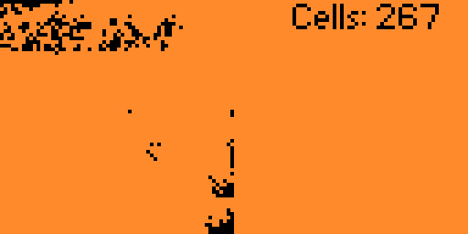

# Simple Cellular Automaton with Genetic Algorithm for Flipper Zero

  
  

## Overview

Это приложение для Flipper Zero, представляющее собой простой клеточный автомат с базовым генетическим алгоритмом. Программа симулирует поведение клеток, которые перемещаются по сетке, потребляют энергию и, при наличии достаточного количества энергии, размножаются. Каждая клетка имеет простую ДНК, которая определяет её движение, а также возможность мутации во время размножения.

### Основные возможности

- **Клеточный автомат:** Каждая клетка имеет координаты, уровень энергии и ДНК.
- **Генетический алгоритм:** Клетки могут мутировать при размножении, что позволяет менять поведение потомков.
- **Энергетическая механика:** Клетки теряют энергию при каждом ходе и могут её пополнять в определённых зонах.
- **Смерть и размножение:** Клетки с нулевой энергией умирают, а клетки с большим запасом энергии пытаются размножиться на соседние позиции.

## Как это работает

Клетки инициализируются с случайными позициями, значениями энергии и ДНК. В основном цикле программа обновляет позиции и уровни энергии клеток, проверяет их выход за границы и проверяет условия для размножения при наличии доступного пространства.

### Генетический алгоритм

ДНК каждой клетки определяет её паттерн движения. При делении существует 10%-ный шанс мутации ДНК, что может незначительно изменить поведение клетки.

### Энергетическая механика

- Клетки теряют энергию с каждым ходом.
- Клетки получают дополнительную энергию, если находятся в верхней части сетки, что симулирует процесс фотосинтеза.
- Клетки с отрицательной энергией удаляются из симуляции.
- Клетки с энергией выше 100 пытаются делиться.

## Лицензия

Этот проект является open-source и распространяется под лицензией MIT.
